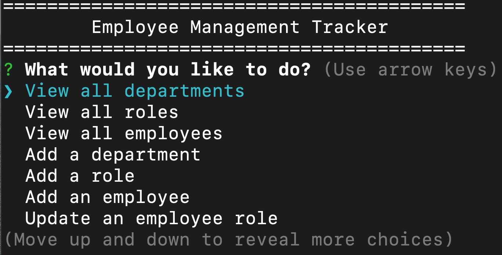

# EmployeeTracker
An application for tracking employees and departments within a company.

## Description

The Employee Management System is a command-line application that allows users to manage departments, roles, and employees within an organization. It provides functionalities such as viewing all departments, roles, and employees, adding new departments, roles, and employees, updating employee roles and managers, deleting departments and roles, and calculating the total utilized budget of a department. The application is built using Node.js and utilizes MySQL as the database management system.

[GitHub Repository](https://github.com/chadkraus87/EmployeeTracker)

https://github.com/chadkraus87/EmployeeTracker/assets/127354484/79dd4bc0-2e3c-4bd7-99ae-27e2b4ecba30

## Table of Contents

- [Installation](#installation)
- [Usage](#usage)
- [License](#license)
- [Contributing](#contributing)
- [Tests](#tests)
- [Questions](#questions)

## Installation

The NPM Inquirer.js package is required to run this application. To install the package, please visit [NPM Inquirer.js documentation](https://www.npmjs.com/package/inquirer).

The Node MySQL 2 package is required to run this application. To install the package, please vist [Node MySQL 2 Documentation](https://www.npmjs.com/package/mysql2).

## Usage

To use the Employee Tracker, please follow these steps:

1. Install Node.js on your machine.
2. Clone this repository to your local machine.
3. Navigate to the project directory in your terminal.
4. Install the required dependencies by running the command `npm install`.
5. Set up your MySQL database by importing the provided schema and sample information.
6. Configure the database connection settings in the `db/connection.js` file.
7. Start the application by running the command `node index.js`.
8. Use the arrow keys to navigate the menu and select the desired actions.
9. Follow the prompts to perform various operations such as adding departments, roles, and employees, updating employee roles and managers, deleting departments and roles, and viewing department budgets.
10. Exit the application by selecting the "Exit" option in the menu.

Note: Make sure you have MySQL installed and running before starting the application.

## License

This project is licensed under the MIT License.

## Contributing

[NPM Inquirer Package](https://www.npmjs.com/package/inquirer)

[Node MySQL 2 Package](https://www.npmjs.com/package/mysql2)

[Schema Objects](https://docs.oracle.com/cd/B19306_01/server.102/b14220/schema.htm)

[Async Function](https://developer.mozilla.org/en-US/docs/Web/JavaScript/Reference/Statements/async_function)

[SQL Syntax](https://www.w3schools.com/sql/sql_syntax.asp)

[Getting Started with MySQL](https://dev.mysql.com/doc/mysql-getting-started/en/#mysql-getting-started-installing)

## Tests

N/A

## Questions

If you have any questions or comments about this project, please contact me at chadkraus87@gmail.com. You can also find more information and other projects on my GitHub https://github.com/chadkraus87. If you encounter any issues or bugs while using this tool, please report them to the project GitHub repository so that they can be addressed. Additionally, contributions to this project are always welcome. If you would like to contribute, please review the project contribution guidelines and submit a pull request. Thank you for your support!
